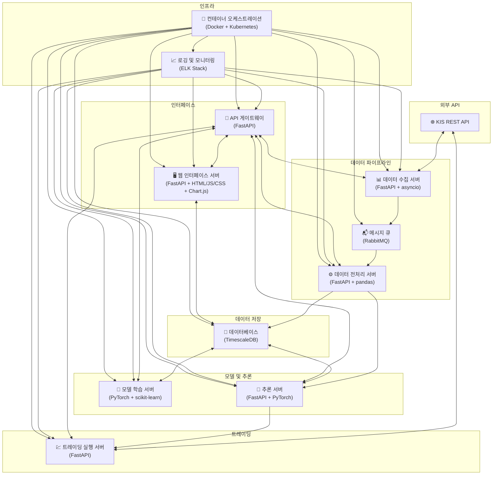
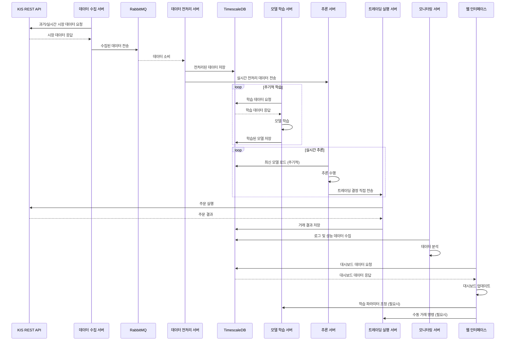

# 강화학습 기반 트레이딩 봇

## 프로젝트 개요

이 프로젝트는 강화학습을 활용한 자동화된 트레이딩 봇 시스템입니다. KIS REST API를 통해 실시간 시장 데이터를 수집하고, 이를 바탕으로 트레이딩 결정을 내리며 실제 거래를 실행합니다.

## 시스템 구조

### 주요 컴포넌트

1. **데이터 수집 서버**
   - 기술 스택: Python, FastAPI, asyncio
   - 기능: KIS REST API를 통한 과거 및 실시간 시장 데이터 수집

2. **데이터 전처리 서버**
   - 기술 스택: Python, FastAPI, pandas
   - 기능: 수집된 데이터의 전처리 및 특성 추출

3. **데이터베이스**
   - 기술 스택: TimescaleDB (PostgreSQL 확장)
   - 기능: 과거 및 실시간 시장 데이터 저장

4. **모델 학습 서버**
   - 기술 스택: Python, PyTorch, scikit-learn
   - 기능: 시장 상황 클러스터링, LSTM 신경망과 A3C 알고리즘 구현

5. **추론 서버**
   - 기술 스택: Python, FastAPI, PyTorch
   - 기능: 학습된 모델 로드 및 실시간 추론

6. **트레이딩 실행 서버**
   - 기술 스택: Python, FastAPI
   - 기능: KIS REST API를 통한 실제 거래 실행, 주문 상태 추적 및 포지션 관리

7. **API 게이트웨이**
   - 기술 스택: Python, FastAPI
   - 기능: 각 서비스에 대한 단일 진입점 제공, 요청 라우팅 및 로드 밸런싱

8. **웹 인터페이스 서버**
   - 기술 스택: Python, FastAPI, HTML/CSS/JavaScript, Chart.js
   - 기능: 모델 학습 파라미터 조절 인터페이스, 학습 결과 및 트레이딩 성과 시각화, 실시간 거래 내역 및 로그 확인 대시보드

9. **메시지 큐**
   - 기술 스택: RabbitMQ
   - 기능: 데이터 수집 서버와 전처리 서버 간의 비동기 메시지 전달

10. **로깅 및 모니터링**
    - 기술 스택: ELK Stack (Elasticsearch, Logstash, Kibana)
    - 기능: 중앙 집중식 로깅 및 모니터링, 시스템 상태 및 성능 시각화

11. **컨테이너 오케스트레이션**
    - 기술 스택: Docker, Kubernetes
    - 기능: 서비스 컨테이너화 및 관리, 자동 스케일링 및 로드 밸런싱

### 시스템 아키텍처 다이어그램



### 데이터 흐름도



## API 문서

기본 URL: `/api/v1`

### 1. 데이터 수집 및 처리

#### GET /data/market
- 설명: 최신 시장 데이터 조회

#### POST /data/collect
- 설명: 데이터 수집 시작

#### POST /data/process
- 설명: 데이터 전처리 시작

### 2. 모델 학습

#### POST /model/train
- 설명: 모델 학습 시작

#### GET /model/status/{job_id}
- 설명: 모델 학습 상태 확인

### 3. 추론

#### POST /inference/predict
- 설명: 현재 시장 데이터를 기반으로 트레이딩 결정 얻기

### 4. 트레이딩 실행

#### POST /trade/execute
- 설명: 추론 결과 또는 수동 입력을 기반으로 거래 실행

#### GET /trade/status/{order_id}
- 설명: 거래 주문 상태 확인

### 5. 대시보드

#### GET /dashboard/performance
- 설명: 트레이딩 성과 지표 조회

#### GET /dashboard/settings
- 설명: 현재 시스템 설정 조회

#### PUT /dashboard/settings
- 설명: 시스템 설정 업데이트

#### GET /dashboard/logs
- 설명: 시스템 로그 조회

자세한 API 명세는 [API 문서](docs/api_docs.md)를 참조하세요.

## 트레이딩 봇 프로젝트 상세 구조

```
/
├── api-gateway/
│   ├── main.py
│   ├── requirements.txt
│   ├── Dockerfile
│   ├── routes/
│   │   ├── __init__.py
│   │   ├── data_routes.py
│   │   ├── model_routes.py
│   │   ├── inference_routes.py
│   │   ├── trade_routes.py
│   │   └── dashboard_routes.py
│   ├── middlewares/
│   │   ├── __init__.py
│   │   ├── auth_middleware.py
│   │   └── logging_middleware.py
│   └── config/
│       ├── __init__.py
│       └── settings.py
├── data-collector/
│   ├── main.py
│   ├── requirements.txt
│   ├── Dockerfile
│   ├── collectors/
│   │   ├── __init__.py
│   │   ├── market_data_collector.py
│   │   └── historical_data_collector.py
│   ├── models/
│   │   ├── __init__.py
│   │   └── data_models.py
│   └── config/
│       ├── __init__.py
│       └── settings.py
├── data-processor/
│   ├── main.py
│   ├── requirements.txt
│   ├── Dockerfile
│   ├── processors/
│   │   ├── __init__.py
│   │   ├── data_cleaner.py
│   │   └── feature_extractor.py
│   ├── features/
│   │   ├── __init__.py
│   │   ├── technical_indicators.py
│   │   └── fundamental_features.py
│   └── config/
│       ├── __init__.py
│       └── settings.py
├── model-trainer/
│   ├── main.py
│   ├── requirements.txt
│   ├── Dockerfile
│   ├── models/
│   │   ├── __init__.py
│   │   ├── lstm_model.py
│   │   └── a3c_model.py
│   ├── trainers/
│   │   ├── __init__.py
│   │   ├── lstm_trainer.py
│   │   └── a3c_trainer.py
│   ├── utils/
│   │   ├── __init__.py
│   │   └── data_loader.py
│   └── config/
│       ├── __init__.py
│       └── settings.py
├── inferencer/
│   ├── main.py
│   ├── requirements.txt
│   ├── Dockerfile
│   ├── models/
│   │   ├── __init__.py
│   │   └── model_loader.py
│   ├── predictors/
│   │   ├── __init__.py
│   │   └── predictor.py
│   └── config/
│       ├── __init__.py
│       └── settings.py
├── trader/
│   ├── main.py
│   ├── requirements.txt
│   ├── Dockerfile
│   ├── executors/
│   │   ├── __init__.py
│   │   └── order_executor.py
│   ├── strategies/
│   │   ├── __init__.py
│   │   └── trading_strategy.py
│   ├── models/
│   │   ├── __init__.py
│   │   └── order_models.py
│   └── config/
│       ├── __init__.py
│       └── settings.py
├── web-interface/
│   ├── main.py
│   ├── requirements.txt
│   ├── Dockerfile
│   ├── static/
│   │   ├── css/
│   │   │   └── styles.css
│   │   ├── js/
│   │   │   ├── dashboard.js
│   │   │   └── charts.js
│   │   └── img/
│   │       └── logo.png
│   ├── templates/
│   │   ├── base.html
│   │   ├── dashboard.html
│   │   ├── settings.html
│   │   └── logs.html
│   ├── routes/
│   │   ├── __init__.py
│   │   ├── dashboard_routes.py
│   │   └── api_routes.py
│   └── config/
│       ├── __init__.py
│       └── settings.py
├── common/
│   ├── __init__.py
│   ├── database.py
│   ├── logger.py
│   ├── utils.py
│   └── exceptions.py
├── tests/
│   ├── unit/
│   │   ├── test_data_collector.py
│   │   ├── test_data_processor.py
│   │   ├── test_model_trainer.py
│   │   ├── test_inferencer.py
│   │   └── test_trader.py
│   └── integration/
│       ├── test_data_pipeline.py
│       ├── test_model_pipeline.py
│       └── test_trading_pipeline.py
├── docs/
│   ├── api_docs.md
│   ├── architecture.md
│   ├── setup_guide.md
│   └── user_manual.md
├── deployment/
│   ├── docker-compose.yml
│   ├── nginx.conf
│   └── kubernetes/
│       ├── api-gateway-deployment.yaml
│       ├── data-collector-deployment.yaml
│       ├── data-processor-deployment.yaml
│       ├── model-trainer-deployment.yaml
│       ├── inferencer-deployment.yaml
│       ├── trader-deployment.yaml
│       └── web-interface-deployment.yaml
├── scripts/
│   ├── setup.sh
│   ├── run_tests.sh
│   └── deploy.sh
├── .gitignore
├── README.md
└── requirements.txt
```

## 주요 컴포넌트 설명

### 1. API 게이트웨이 (api-gateway/)
- `main.py`: FastAPI 애플리케이션의 진입점
- `routes/`: 각 서비스에 대한 라우트 정의
- `middlewares/`: 인증 및 로깅 미들웨어
- `config/`: API 게이트웨이 설정

### 2. 데이터 수집기 (data-collector/)
- `collectors/`: 시장 데이터 및 과거 데이터 수집 로직
- `models/`: 데이터 모델 정의
- `config/`: 데이터 수집기 설정

### 3. 데이터 처리기 (data-processor/)
- `processors/`: 데이터 정제 및 특성 추출 로직
- `features/`: 기술적 지표 및 기본적 특성 계산
- `config/`: 데이터 처리기 설정

### 4. 모델 트레이너 (model-trainer/)
- `models/`: LSTM 및 A3C 모델 구현
- `trainers/`: 모델 학습 로직
- `utils/`: 데이터 로딩 등의 유틸리티 함수
- `config/`: 모델 트레이너 설정

### 5. 추론기 (inferencer/)
- `models/`: 학습된 모델 로딩
- `predictors/`: 실시간 예측 로직
- `config/`: 추론기 설정

### 6. 트레이더 (trader/)
- `executors/`: 주문 실행 로직
- `strategies/`: 트레이딩 전략 구현
- `models/`: 주문 관련 데이터 모델
- `config/`: 트레이더 설정

### 7. 웹 인터페이스 (web-interface/)
- `static/`: CSS, JavaScript, 이미지 파일
- `templates/`: HTML 템플릿
- `routes/`: 웹 인터페이스 라우트 및 API 엔드포인트
- `config/`: 웹 인터페이스 설정

### 8. 공통 모듈 (common/)
- 데이터베이스 연결, 로깅, 유틸리티 함수 등 공통 기능

### 9. 테스트 (tests/)
- `unit/`: 각 컴포넌트의 단위 테스트
- `integration/`: 여러 컴포넌트를 통합한 테스트

### 10. 문서 (docs/)
- API 문서, 아키텍처 설명, 설정 가이드, 사용자 매뉴얼

### 11. 배포 (deployment/)
- Docker Compose 설정
- Kubernetes 배포 파일
- Nginx 설정

### 12. 스크립트 (scripts/)
- 환경 설정, 테스트 실행, 배포 자동화 스크립트

## 주요 파일 설명

- `main.py`: 각 서비스의 주 진입점. FastAPI 애플리케이션 초기화 및 설정
- `requirements.txt`: 각 서비스의 Python 의존성 목록
- `Dockerfile`: 각 서비스의 Docker 이미지 빌드 설정
- `__init__.py`: Python 패키지 초기화 파일
- `settings.py`: 서비스별 설정 파일 (환경 변수, 상수 등)

## 개발 및 배포 워크플로우

1. 개발자는 각 컴포넌트 폴더에서 독립적으로 개발
2. 공통 모듈은 `common/` 폴더에 구현하여 재사용
3. 단위 테스트는 `tests/unit/`에, 통합 테스트는 `tests/integration/`에 작성
4. `scripts/run_tests.sh`를 사용하여 모든 테스트 실행
5. 각 서비스는 독립적으로 Dockerize되어 `deployment/docker-compose.yml`로 로컬 테스트
6. Kubernetes 배포는 `deployment/kubernetes/` 폴더의 YAML 파일 사용
7. `scripts/deploy.sh`를 사용하여 프로덕션 환경에 배포

이 구조는 마이크로서비스 아키텍처를 따르며, 각 컴포넌트를 독립적으로 개발, 테스트, 배포할 수 있도록 설계되었습니다. 또한 공통 모듈을 통해 코드 재사용성을 높이고, 문서화와 테스트를 통해 프로젝트의 유지보수성과 안정성을 확보합니다.

## 설치 및 실행

1. 저장소 클론:
   ```
   git clone https://github.com/your-username/trading-bot.git
   cd trading-bot
   ```

2. 의존성 설치:
   ```
   pip install -r requirements.txt
   ```

3. 환경 변수 설정:
   ```
   cp .env.example .env
   # .env 파일을 편집하여 필요한 설정을 입력하세요.
   ```

4. Docker 컨테이너 실행:
   ```
   docker-compose up -d
   ```

5. 서비스 접근:
   - 웹 인터페이스: `http://localhost:8080`
   - API 게이트웨이: `http://localhost:8000`

## 개발 가이드

- 각 서비스는 독립적인 FastAPI 애플리케이션으로 구현됩니다.
- 공통 모듈은 `common/` 디렉토리에 위치하며, 각 서비스에서 임포트하여 사용합니다.
- 새로운 기능 개발 시 단위 테스트와 통합 테스트를 작성해주세요.
- 코드 스타일은 Black과 isort를 사용하여 일관성을 유지합니다.

## 기여 가이드

1. 이슈 생성 또는 기존 이슈 선택
2. 개발용 브랜치 생성 (`feature/issue-number-description`)
3. 변경사항 커밋
4. 테스트 실행 및 패스 확인
5. Pull Request 생성
6. 코드 리뷰 후 main 브랜치에 머지

## 라이선스

이 프로젝트는 내꺼(변지환)입니다. 내맘대로만 할 수 있습니다.