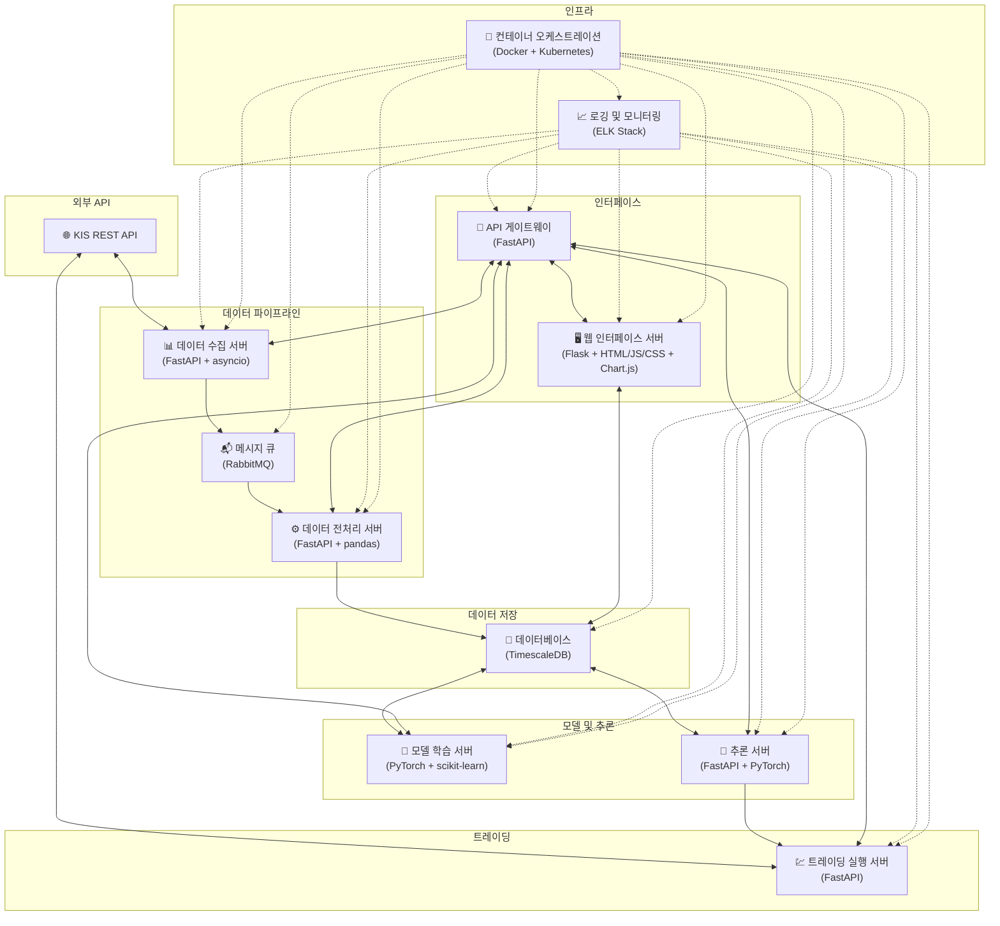
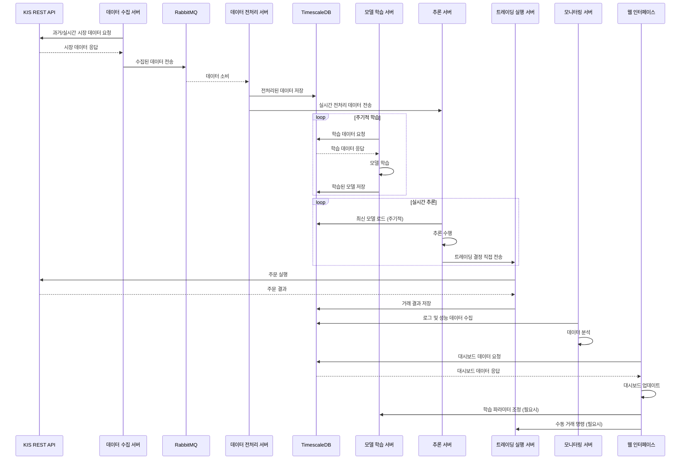

# 강화학습 기반 주식 선물 자동매매 시스템

## 프로젝트 개요

이 프로젝트는 강화학습을 활용한 자동화된 주식 선물 트레이딩 시스템입니다. KIS REST API를 통해 실시간 시장 데이터를 수집하고, 이를 바탕으로 트레이딩 결정을 내리며 실제 거래를 실행합니다.

## 시스템 구조

### 주요 컴포넌트

1. **데이터 수집 서버**
   - 기술 스택: Python, FastAPI, asyncio
   - 기능: KIS REST API를 통한 과거 및 실시간 시장 데이터 수집

2. **데이터 전처리 서버**
   - 기술 스택: Python, FastAPI, TA-lib
   - 기능: 수집된 데이터의 전처리 및 특성 추출

3. **데이터베이스**
   - 기술 스택: TimescaleDB (PostgreSQL 확장)
   - 기능: 과거 및 실시간 시장 데이터 저장

4. **모델 학습 서버**
   - 기술 스택: Python, PyTorch, scikit-learn
   - 기능: 시장 상황 클러스터링, LSTM 신경망과 A3C 알고리즘 구현

5. **추론 서버**
   - 기술 스택: Python, FastAPI, PyTorch
   - 기능: 학습된 모델 로드 및 실시간 추론

6. **트레이딩 실행 서버**
   - 기술 스택: Python, FastAPI
   - 기능: KIS REST API를 통한 실제 거래 실행, 주문 상태 추적 및 포지션 관리

7. **API 게이트웨이**
   - 기술 스택: Python, FastAPI
   - 기능: 각 서비스에 대한 단일 진입점 제공, 요청 라우팅 및 로드 밸런싱

8. **웹 인터페이스 서버**
   - 기술 스택: Python, Flask, HTML/CSS/JavaScript, Chart.js
   - 기능: 모델 학습 파라미터 조절 인터페이스, 학습 결과 및 트레이딩 성과 시각화, 실시간 거래 내역 및 로그 확인 대시보드

9. **메시지 큐**
   - 기술 스택: RabbitMQ
   - 기능: 데이터 수집 서버와 전처리 서버 간의 비동기 메시지 전달

10. **로깅 및 모니터링**
    - 기술 스택: ELK Stack (Elasticsearch, Logstash, Kibana)
    - 기능: 중앙 집중식 로깅 및 모니터링, 시스템 상태 및 성능 시각화

11. **컨테이너 오케스트레이션**
    - 기술 스택: Docker, Kubernetes
    - 기능: 서비스 컨테이너화 및 관리, 자동 스케일링 및 로드 밸런싱

### 시스템 아키텍처 다이어그램



### 데이터 흐름도



이 데이터 흐름도는 시스템의 각 컴포넌트 간 상호작용을 시각적으로 표현합니다:

1. 데이터 수집 서버가 KIS REST API로부터 시장 데이터를 수집합니다.
2. 수집된 데이터는 RabbitMQ를 통해 데이터 전처리 서버로 전송됩니다.
3. 전처리된 데이터는 TimescaleDB에 저장되고, 실시간으로 추론 서버에 전송됩니다.
4. 모델 학습 서버는 주기적으로 데이터베이스에서 데이터를 가져와 모델을 학습하고 업데이트합니다.
5. 추론 서버는 최신 모델을 사용하여 실시간으로 트레이딩 결정을 내리고, 이를 트레이딩 실행 서버에 전송합니다.
6. 트레이딩 실행 서버는 KIS API를 통해 실제 주문을 실행하고 결과를 데이터베이스에 저장합니다.
7. 모니터링 서버는 지속적으로 시스템 성능을 모니터링하고 분석합니다.
8. 웹 인터페이스는 사용자에게 실시간 대시보드를 제공하고, 필요시 수동 개입을 가능하게 합니다.

이 흐름은 데이터의 수집부터 거래 실행까지의 전체 과정을 포괄하며, 시스템의 각 부분이 어떻게 상호작용하는지 명확히 보여줍니다.

## 설치 및 실행

1. 저장소 클론:
   ```
   git clone https://github.com/your-username/trading-bot.git
   cd trading-bot
   ```

2. 환경 변수 설정:
   ```
   cp .env.example .env
   # .env 파일을 편집하여 필요한 설정을 입력하세요.
   ```

3. Docker Compose를 사용한 로컬 실행:
   ```
   docker-compose up -d
   ```

4. Kubernetes를 사용한 프로덕션 배포:
   ```
   kubectl apply -f deployment/kubernetes/
   ```

5. 서비스 접근:
   - 웹 인터페이스: `http://localhost:80`
   - API 게이트웨이: `http://localhost:8000`

## AWS 배포 구성

AWS에서는 서비스의 특성에 따라 다음과 같이 인스턴스를 그룹화하여 배포합니다:

1. 고성능 인스턴스 (예: c5.2xlarge):
   - 모델 트레이너
   - 추론기

2. 중간 성능 인스턴스 (예: t3.medium):
   - API 게이트웨이
   - 데이터 프로세서
   - 트레이더

3. 낮은 성능 인스턴스 (예: t3.small):
   - 데이터 수집기
   - 웹 인터페이스

이 구성을 통해 비용 효율성과 리소스 활용도를 높이면서도 각 서비스의 성능 요구사항을 만족시킬 수 있습니다.

## 개발 가이드

- 각 서비스는 독립적인 FastAPI 또는 Flask 애플리케이션으로 구현됩니다.
- 공통 모듈은 `common/` 디렉토리에 위치하며, 각 서비스에서 임포트하여 사용합니다.
- 새로운 기능 개발 시 단위 테스트와 통합 테스트를 작성해주세요.
- 코드 스타일은 Black과 isort를 사용하여 일관성을 유지합니다.

## 기여 가이드

1. 이슈 생성 또는 기존 이슈 선택
2. 개발용 브랜치 생성 (`feature/issue-number-description`)
3. 변경사항 커밋
4. 테스트 실행 및 패스 확인
5. Pull Request 생성
6. 코드 리뷰 후 main 브랜치에 머지

## API 문서

자세한 API 문서는 [API 문서](docs/api_docs.md)를 참조하세요.

## 라이선스

이 프로젝트는 MIT 라이선스 하에 있습니다. 자세한 내용은 [LICENSE](LICENSE) 파일을 참조하세요.
